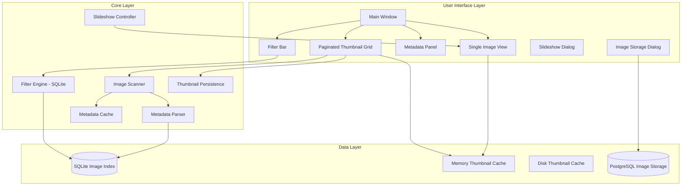

# Stable Diffusion Image Viewer - Project Plan

## Overview
A desktop image viewer application tailored for Stable Diffusion generated images, with support for A1111 and ComfyUI metadata extraction, advanced prompt filtering, fullscreen viewing, and slideshow mode.

## Technology Stack

**Python with PyQt6** was selected for:
- Native desktop performance
- Excellent image handling capabilities
- Built-in support for PNG/JPEG metadata (EXIF, PNG text chunks)
- Cross-platform (Windows, macOS, Linux)
- Simple deployment with PyInstaller

## Architecture



## Implemented Features

### 1. Metadata Extraction
- **PNG**: Read PNG text chunks (A1111 stores metadata in `parameters` chunk, ComfyUI in `workflow` and `prompt` chunks)
- **JPEG**: Read EXIF data and user comments
- Extract: Prompt, Negative Prompt, Model, Seed, CFG Scale, Sampler, Steps, Dimensions
- **Multi-line prompt handling**: Properly joins multi-line prompts with commas
- **Special character handling**: Robust parsing of prompts with special characters

### 2. Filtering System
- Positive filtering: Show only images containing ALL specified substrings in prompt
- Negative filtering: Hide images containing ANY specified substring in prompt
- Support for multiple filter terms (comma-separated)
- Real-time filtering as user types
- Case-insensitive substring matching

### 3. Viewing Modes
- **Paginated Thumbnail Grid**: Browse images with pagination (100 per page) for large collections
- **Single Image View**: View image at full resolution with metadata sidebar
- **Fullscreen Mode**: Distraction-free viewing with keyboard navigation
- **Slideshow Mode**: Auto-advance with configurable interval (1-60 seconds), random order option

### 4. Navigation
- Arrow keys for previous/next image
- F5 for slideshow controls
- F11 for fullscreen toggle
- Escape to exit fullscreen
- Ctrl+Mouse wheel for zoom in/out
- Ctrl+0 to reset zoom

### 5. Caching System (Added During Testing)
- **Memory Thumbnail Cache**: LRU cache for fast thumbnail access
- **Disk Thumbnail Cache**: Persistent thumbnail storage to avoid regeneration
- **Metadata Cache**: Optional JSON-based metadata caching per folder
- **Cache Management**: Menu options to clear caches, command-line reset option

### 6. Image Storage (Added During Testing)
- **SQLite Image Index**: Fast filtering and metadata queries
- **PostgreSQL Large Objects**: Scalable storage for full images (optional)
- **Content-addressable storage**: SHA256 hashing for deduplication

### 7. Command-Line Interface (Added During Testing)
- `--reset` / `--clear-db`: Clear all caches and rebuild from scratch
- `--no-confirm`: Skip confirmation dialog for automated usage
- `--folder` / `-f`: Open a specific folder on startup
- `--version` / `-v`: Show version number
- `--help` / `-h`: Show help message

## Final Project Structure

```
sd-image-viewer/
├── src/
│   ├── __init__.py
│   ├── main.py                      # Application entry point with CLI args
│   ├── models/
│   │   ├── __init__.py
│   │   └── image_data.py            # Image metadata dataclass
│   ├── core/
│   │   ├── __init__.py
│   │   ├── metadata_parser.py       # A1111/ComfyUI metadata extraction
│   │   ├── image_scanner.py         # Directory scanning
│   │   ├── image_index.py           # SQLite index for fast filtering
│   │   ├── metadata_cache.py        # JSON metadata caching
│   │   ├── thumbnail_persistence.py # Disk thumbnail cache
│   │   ├── image_storage.py         # SQLite BLOB storage
│   │   └── postgres_image_storage.py # PostgreSQL large object storage
│   ├── ui/
│   │   ├── __init__.py
│   │   ├── main_window.py           # Main window UI
│   │   ├── thumbnail_grid.py        # Basic thumbnail browser
│   │   ├── paginated_thumbnail_grid.py # Paginated thumbnail browser
│   │   ├── image_viewer.py          # Single image view
│   │   ├── metadata_panel.py        # Metadata display
│   │   ├── filter_bar.py            # Filter input UI
│   │   ├── slideshow_dialog.py      # Slideshow settings
│   │   └── image_storage_dialog.py  # Storage management UI
│   └── utils/
│       ├── __init__.py
│       └── image_cache.py           # Memory thumbnail cache
├── docs/
│   └── database-recommendations.md  # Scaling recommendations
├── plans/
│   └── project-plan.md              # This file
├── requirements.txt
├── README.md
└── .gitignore
```

## Implementation Phases (Actual)

### Phase 1: Foundation ✅
1. Set up project structure
2. Implement metadata parser for A1111 PNG files
3. Implement metadata parser for ComfyUI PNG files
4. Create image scanner and indexer

### Phase 2: Core UI ✅
1. Build main window with thumbnail grid
2. Implement single image view
3. Add metadata panel display
4. Create folder browser

### Phase 3: Filtering ✅
1. Implement prompt substring filtering
2. Add filter bar UI
3. Optimize filter performance with SQLite index

### Phase 4: Advanced Features ✅
1. Add fullscreen mode
2. Implement slideshow with timer
3. Add keyboard shortcuts
4. Image export/copy functionality

### Phase 5: Performance & Scaling (Added During Testing) ✅
1. Pagination for large image collections (6000+ images)
2. Memory thumbnail caching with LRU eviction
3. Disk thumbnail persistence
4. Metadata caching (optional)
5. PostgreSQL integration for large-scale storage

### Phase 6: Polish ✅
1. Error handling for metadata parsing edge cases
2. Command-line interface for automation
3. Documentation
4. Cache management UI

## Issues Discovered During Testing

### 1. Metadata Parsing Edge Cases
- **Problem**: Special characters in prompts caused parsing errors
- **Solution**: Added `safe_str()` and `safe_int()` helper functions with proper type checking
- **Lesson**: Always handle edge cases in user-generated content

### 2. Multi-line Prompt Handling
- **Problem**: Multi-line prompts were being truncated
- **Solution**: Join lines with commas instead of taking only the first line
- **Lesson**: Test with real-world data early in development

### 3. UI Freeze with Large Collections
- **Problem**: Loading 6000+ images caused the UI to freeze
- **Solution**: Implemented pagination (100 images per page)
- **Lesson**: Always consider scalability from the start

### 4. Type Handling in Database
- **Problem**: List and dict values from ComfyUI metadata caused SQLite errors
- **Solution**: Added type checking and JSON serialization for complex types
- **Lesson**: Validate and sanitize all data before database insertion

### 5. Dynamic UI Sizing
- **Problem**: Fixed-size UI elements didn't adapt to content
- **Solution**: Implemented dynamic resizing based on content
- **Lesson**: Design for flexibility, not fixed dimensions

## Metadata Format Reference

### A1111 PNG Metadata
Stored in PNG text chunk named `parameters`:
```
Prompt text here
Negative prompt: negative text here
Steps: 20, Sampler: DPM++ 2M Karras, CFG scale: 7, Seed: 12345, Size: 512x768, Model hash: abc123, Model: model-name
```

### ComfyUI PNG Metadata
Stored in PNG text chunks:
- `workflow`: JSON workflow definition
- `prompt`: JSON prompt data with node information

## Recommendations for Future Prompting

### 1. Specify Scale Requirements Upfront
**Original prompt gap**: No mention of expected collection sizes
**Recommendation**: Always specify expected data volumes:
- "The viewer should handle collections of 10,000+ images efficiently"
- "Thumbnail loading should not block the UI"
- "Consider pagination or virtual scrolling for large lists"

### 2. Define Error Handling Strategy
**Original prompt gap**: No mention of error handling for malformed metadata
**Recommendation**: Include error handling requirements:
- "Handle malformed or missing metadata gracefully"
- "Log parsing errors without crashing"
- "Provide user feedback for unsupported formats"

### 3. Specify Caching Requirements
**Original prompt gap**: Caching was not mentioned in original requirements
**Recommendation**: Include performance requirements:
- "Cache thumbnails to avoid regeneration on subsequent loads"
- "Consider persistent caching across application restarts"
- "Provide cache management options (clear, size limits)"

### 4. Include CLI Requirements
**Original prompt gap**: No mention of command-line interface
**Recommendation**: Consider automation needs:
- "Provide command-line options for common operations"
- "Support headless/scripted usage where appropriate"
- "Include reset/rebuild options for troubleshooting"

### 5. Test Data Diversity
**Original prompt gap**: No mention of testing with diverse real-world data
**Recommendation**: Specify testing requirements:
- "Test with images from multiple SD versions and UIs"
- "Include edge cases: special characters, very long prompts, missing fields"
- "Test with various collection sizes (10, 100, 1000, 10000 images)"

### 6. Database Scaling Strategy
**Original prompt gap**: SQLite was assumed sufficient without scale analysis
**Recommendation**: Include scaling considerations:
- "Define expected maximum collection size"
- "Consider database migration path for growth"
- "Document performance characteristics at different scales"

### 7. UI Responsiveness Requirements
**Original prompt gap**: No specific UI performance requirements
**Recommendation**: Include responsiveness criteria:
- "UI should remain responsive during folder scanning"
- "Progress indicators for long-running operations"
- "Background loading for thumbnails"

## Improved Initial Prompt Template

For future similar projects, use this template:

```
Project: [Name]

## Core Requirements
- [Feature 1]
- [Feature 2]

## Scale Requirements
- Expected data volume: [X items]
- Performance target: [Y ms response time]
- Concurrent users: [Z]

## Error Handling
- How to handle malformed input: [strategy]
- Logging requirements: [level, destination]
- User feedback for errors: [approach]

## Performance Requirements
- Caching strategy: [memory, disk, both]
- UI responsiveness: [specific targets]
- Background processing: [requirements]

## CLI/Automation
- Command-line options needed: [list]
- Scripting support: [requirements]

## Testing Requirements
- Test data characteristics: [description]
- Edge cases to consider: [list]
- Performance testing: [approach]
```

## Notes
- Use SQLite for image index to enable fast filtering
- Implement image caching to improve thumbnail loading performance
- Support drag-and-drop folder opening (future enhancement)
- Remember last opened folder (future enhancement)
- Consider virtual scrolling for even larger collections (future enhancement)
